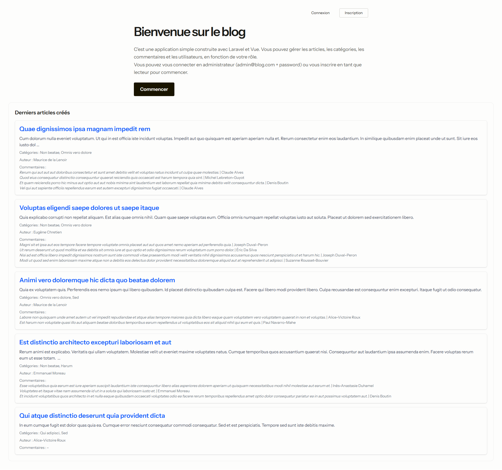
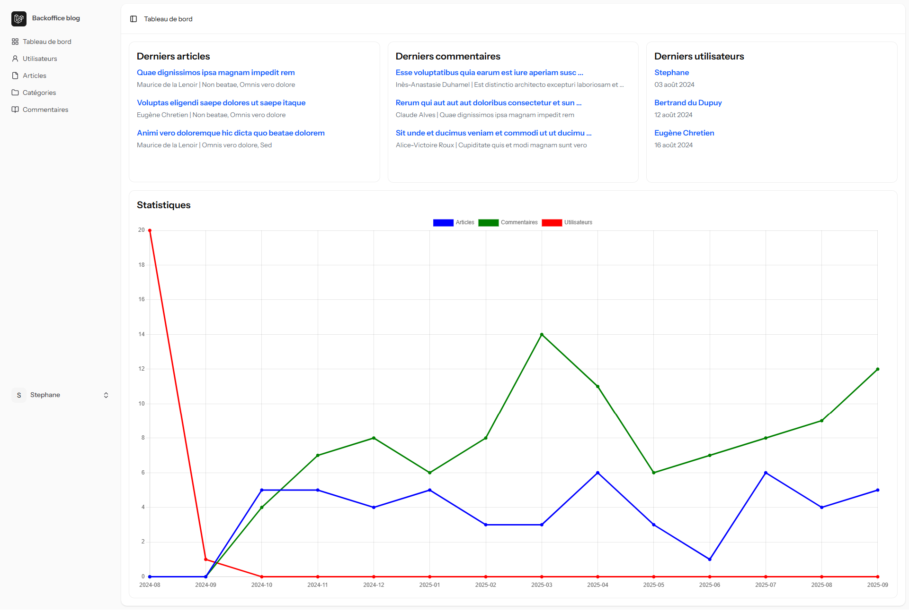
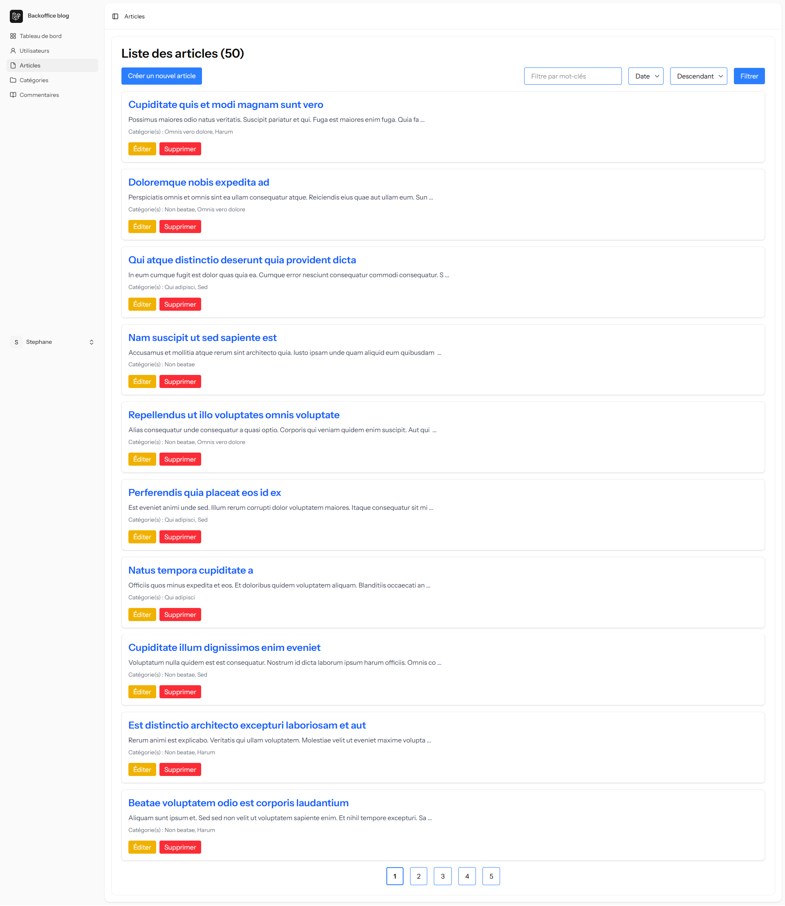
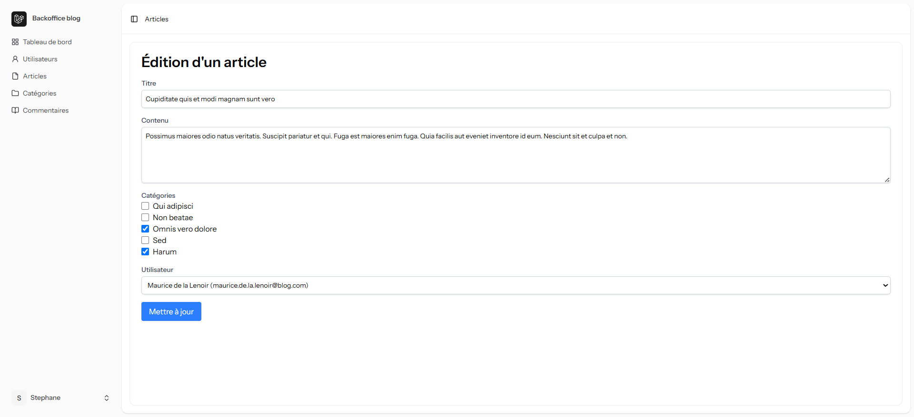

# ✅ Blog - Laravel / Inertia / Vue

Une application **Blog** basique, construite avec **Laravel 12**, **Inertia 2** et **Vue.js 3**.  
Elle permet de gérer des articles, des catégories, des commentaires et des utilisateurs.  
La page d'accueil du frontoffice montre les derniers articles et permet la création ou la connexion à un compte.  
La page d'accueil du backoffice montre les derniers éléments créés ainsi qu'un graphique d'évolution.  
L'utilisateur en fonction de son rôle, pourra créer/lire/modifier/supprimer des éléments.    
Un filtre de recherche et une pagination sont présents sur les listes.
L'utilisateur connecté a accès à son profil pour le modifier.

## 👀 Aperçu

## 🛠️ Technologies
- **Backend** : Laravel 12, Inertia 2
- **Frontend** : Vue.js 3, Tailwind CSS  
- **Langages** : Php, Sql, Html, Css, JavaScript, TypeScript
- **Outils** : Composer, Node, Vite, VS Code, Git, MySql/PostgreSql 

## ✨ Fonctionnalités
- Authentification et profil utilisateur
- Création/Lecture/Modification/Suppression un élément de type article/catégorie/commentaire/utilisateur 
- Filtrage d'une recherche et pagination 
- Sauvegarde en base de données

## ⚙️ Installation

- git clone https://github.com/stephane-aravit/blog.git
- cd blog
- composer install
- npm install
- cp .env.example .env
- php artisan key:generate
- => créer la base de données et renseigner les identifiants dans le .env
- php artisan migrate --seed
- npm run dev
- php artisan serve

🌍 <a href="https://blog-production-3592.up.railway.app" target="_blank" rel="noopener noreferrer">Voir la démo en ligne sur Railway</a>
